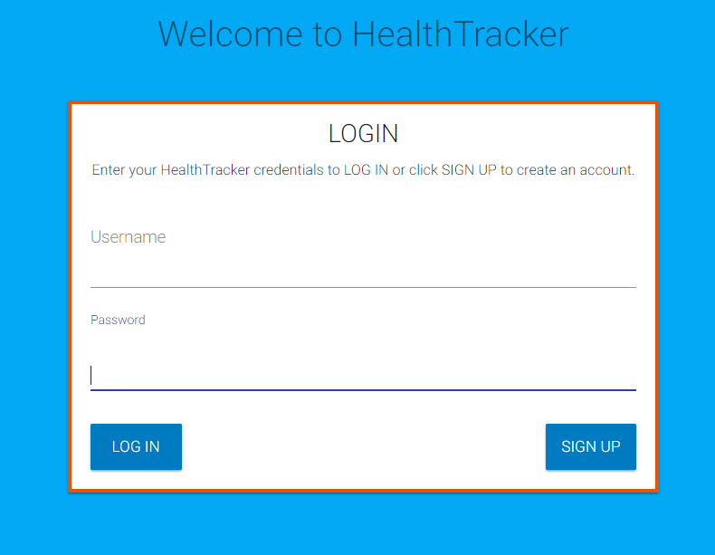
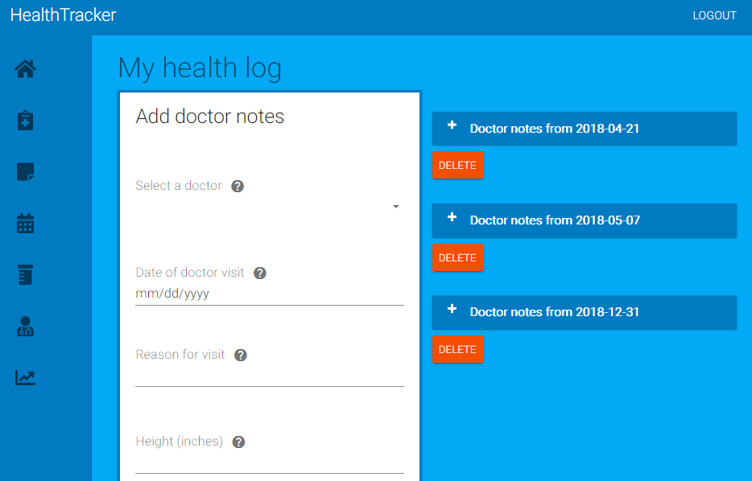
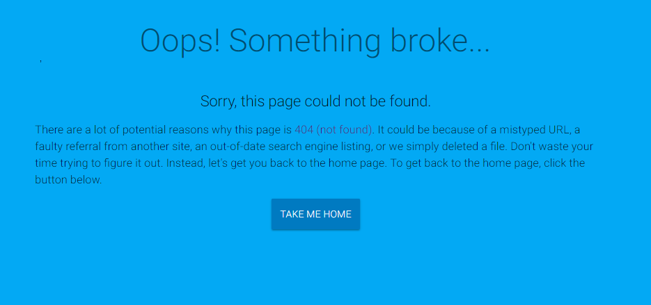

# Healthify

Healthify is a MERN stack application that allows you to log and keep track of your health information so that you can easily share and discuss that information with your doctor at your next visit.

##  Screenshots

### Login page

### Sign up page

### Home page

### My health log

### My symptom journal

### Appointments

### Prescriptions

### Doctors list

### Clinics list

### Charts

### 404 Not found page

##  About this project
Many people visit the doctor office on a regular basis (sometimes multiple times per week) and have no way of accurately and efficiently keeping track of their health information, such as upcoming appointments, prescriptions, symptoms they experience away from the doctor office, notes from their doctors, and height and weight measurements. 

 Managing all that information can be quite the challenge because it is often written on paper and scattered across multiple documents and files. Also, information often comes from multiple doctors and clinics. Plus, there is no one, central location to store the information. For example, appointments might be scheduled on a paper calendar, but the notes from that appointment are located in a separate notebook. You might experience a symptom away from the doctor office, but you don't write it down and forget to tell your doctor at your next visit.  As you can see, there are many problems with the current methods for managing one's health. Keeping track of this information is a time-consuming, manual process. As a result, this information can easily be lost, misplaced, or forgotten over time.

 So, it is safe to say that managing our health information is difficult. It gets even more complex and challenging when trying to manage that inforation for someone else (for example, a child or grandparent).

 This is where HealthTracker comes in. HealthTracker is a web application that allows you to log and keep track of health information so that you can easily share and discuss that information with your doctor(s) during your next visit. It is <b>one app</b> that you can use to create and maintain a health journal for yourself or for another person. No more having to carry around bulky notebooks, papers, and files to each and every doctor visit. Instead, all you need to do is bring your tablet to the doctor office, open up the app, and all the relevant information is there for the doctor to see.

###  How the app is built
On the front end side, this project is built using React, which is an open-source Javascript library developed at Facebook specifically for the task of developing user interfaces. React relies on a component-based architecture where elements of the user interface are broken into small chunks of code called components. Material UI is a css framework that helps with building these components. Material UI is a React component library that implements Google’s material design.

On the back end side, this project uses MongoDB, Node, Express, Mongoose ORM (Object Relational Mapper), Passport, and various third party packages. Node, MongoDB, and Mongoose are used to query and route data in the app. Express is the backend web framework used for this app. Passport is authentication middleware for Node.js (that is, the technology used to log users into the app). 

###  App workflow

#### Authentication
When you first visit the app, you will be prompted to log in (if you have already created an account) or sign up (if you are a new user). To sign up, you will need to provide an email address as well as create a username and password. Authentication is required because it ensures that a user's health information is protected and blocked from other users.

#### Home 
After you authenticate, you are taken to the Home/Landing page. From this page, you can navigate to all the different pages with the app to keep track of your health information.

#### My health log
The My health log page is where you can manually record doctor appointment information, including doctor being seen, date of visit, reason for visit, weight, height, and visit notes. You can track your height and weight measurements over time from the Charts page.

#### My symptom journal
The My symptom journal page is a log of symptoms that you can share with your doctor at your next doctor visit. You can record symptoms you experience away from the doctor office, the time when the symptom occurred, and add comments to each entry. You have a list of symptoms to choose from (for example, Dizzy, Shortness of Breath, Fainted, Swelling, Heart Fluttering, Fatigue, Other). You have a text field where you can enter more information about a symptom and list any useful information that will help you remember details of the symptom when you see your doctor at your next visit.

#### Appointments
The Appointments page lists your upcoming appoinments and related information in table format. You can add and remove appointments from this page.

#### Prescriptions
The Prescriptions page is where you can enter information about medications prescribed by your doctor, including prescription name, name of doctor who prescribed the medication, date prescribed, number of tablets, and directions for use.

#### Doctors and clinics
The Doctors and clinics page has contact information for each of your doctors, such as doctor name, email address, and office location. You can also add contact information for each clinic. After you add your doctors and clinics, you can associate these doctors and clinics with other information, such as appointments, in the app.

#### Charts
The Charts page includes two line graphs. The top graph displays your weight data over time. This data is pulled from the weight measurements you entered on the My health log page. The second graph is similar. It displays your height data over time.
##  Getting started

The following section will take you through the steps of setting up this app and getting it running locally on your computer.

If you don't want to set up this project locally and just want to see the deployed application, go to <https://myhealthtracker.herokuapp.com/>.

To set up this application locally on your computer, perform the following steps:
  1. [Clone the repository](#clone-repository)
  2. [Install Node.js](#install-node)
  3. [Install the project dependencies](#dependencies)
  4. [Install yarn](#install-yarn)
  5. [Install MongoDB](#install-mongo)
  6. [Start the daemon for MongoDB](#mongod)
  7. [Start the MongoDB shell](#mongoshell)
  8. [Install Robo 3T](#install-robo)
  9. [Seed MongoDB](#seed)
  10. [Start the Express server and React development server](#start-server)

###   1. Clone the repository
The first step is to clone the project repository to a local directory on your computer. To clone the repository, run the following commands:
<pre>
git clone https://github.com/philipstubbs13/MedLog.git
cd ./MedLog
</pre>

###   2. Install Node.js

If you don't already have Node.js installed on your computer, you can install the latest version <a href="https://nodejs.org/en/">here</a>.

###  3. Install yarn
To be able to install the dependencies and start the application locally, you will need to install yarn. Yarn is a package manager like npm.

To install yarn, run the following command:
<pre>npm install -g yarn</pre>

For more information about yarn and other installation options, see the yarn documentation: https://yarnpkg.com/en/.

###   4. Install the project dependencies.

The following packages are dependencies to the project.

<ul>
	<li><b>express</b> -  a Node.js web application framework (https://www.npmjs.com/package/express).</li>
	<li><b>body-parser</b> - a package used to parse incoming request bodies in a middleware. (https://www.npmjs.com/package/body-parser)</li>
  <li><b>axios</b> - a promise based HTTP client for the browser and node.js (https://www.npmjs.com/package/axios)</li>
  <li><b>mongoose</b> - an ORM that allows you to connect to your MongoDB database and allows you to have access to the MongoDB commands to perform create, read, update, and delete operations on the database (https://www.npmjs.com/package/mongoose).</li>
  <li><b>morgan</b> - an HTML request logger middleware for Node.js that is used to log requests to your application (https://www.npmjs.com/package/morgan).</li>
  <li><b>connect-mongo</b> - MongoDB session store used for user authentication (<https://www.npmjs.com/package/connect-mongo>)</li>
  <li><b>express-session</b> - Express and Mongoose session storage for user authentication (<https://www.npmjs.com/package/express-sessions>)</li>
  <li><b>fusioncharts</b>: package that includes simple and complex charts (https://www.npmjs.com/package/fusioncharts).</li>
  <li><b>chartist</b>: package for creating customizable, responsive charts (https://gionkunz.github.io/chartist-js/)</li>
  <li><b>react-chartist</b>: package for creating React chart components (https://www.npmjs.com/package/react-chartist)</li>
  <li><b>material-ui</b> - a React component library that implements Google's material design (https://material-ui-next.com)</li>
  <li><b>moment</b> - package used for formatting dates (https://www.npmjs.com/package/moment)</li>
  <li><b>passport</b> - package used for authenticating requests (https://www.npmjs.com/package/passport)</li>
  <li><b>passport-local</b> - package that allows you to authenticate using a username and password in a Node.js application (https://www.npmjs.com/package/passport-local)</li>
  <li><b>react</b> - package for accessing React (https://www.npmjs.com/package/react)</li>
  <li><b>react-dom</b> - serves as the entry point of the DOM-related rendering paths (https://www.npmjs.com/package/react-dom).</li>
  <li><b>react-fusioncharts</b> - React component for FusionCharts (https://www.npmjs.com/package/react-fusioncharts)</li>
  <li><b>react-router</b> - package that provides the core routing functionality (https://www.npmjs.com/package/react-router).</li>
  <li><b>react-router-dom</b> - a third party routing library (<https://www.npmjs.com/package/react-router-dom>)</li>
  <li><b>react-scripts</b>: package that includes scripts and configuration used by Create React App (https://www.npmjs.com/package/react-scripts)</li>
  <li><b>rebass</b> - library of UI components for React (https://www.npmjs.com/package/rebass)</li>
</ul>

Version information for each of these packages is available in the <b>package.json</b> file in the project root directory and in the <b>client</b> directory.

After you clone the repository to a local directory, change directory to the project root directory and run the following command to install the required packages:

<pre>yarn install</pre>

Change directory to the <b>MedLog/client</b> directory and run the following command to install the client dependencies.

<pre>yarn install</pre>

###   5. Install MongoDB

For installation instructions, see <a href="https://github.com/philipstubbs13/coding-tips-tricks-resources/blob/master/MongoDB/Installing-MongoDB.md">Installing MongoDB</a>.

###   6. Start the daemon for MongoDB

Open another terminal window and run the following command to start the daemon process for MongoDB, which handles data requests, manages data access, and performs background management operations.

<pre>mongod</pre>

<b>Note:</b> You want to keep the mongod process running in the background during development.

###   7. Start the MongoDB shell

In a separate terminal window, run the following command to start up the MongoDB shell.

<pre>mongo</pre>

###   8. Install Robo 3T

If you don't already have Robo 3T installed on your computer, you can install the latest version <a href="https://robomongo.org/download">here</a>.

For this project, Robo 3T is similar to MySQL Workbench (if you are used to working with MySQL databases). Robo 3T is not required. But, similar to MySQL Workbench, it is a graphical user interface that is used to visually see the database and database collections (as opposed to using the command line interface for MongoDB).

###  9. Seed the database.

Run the following command from the project root directory (MedLog) to populate your local development database with dummy data.

<pre>yarn seed</pre>

###   10. Start the Express server and React development server.

After performing all of the setup steps in the <b>Getting started</b> section, navigate to the project root directory (<b>MedLog</b>) and run the following command to start the Express server and React development server.

<pre>yarn start</pre>

After the development server has started, a Chrome browser window should open, and you should see the login screen for the application. If the browser does not automatically open after the server starts, you can verify that the application is working locally on your computer by opening Chrome and going to <a href="http://localhost:3000">http://localhost:3000</a>.

##  Technologies used to create app

* [Back end technolgies](#Backend)
* [Front end technologies](#Frontend)

###  Back end technologies

* Node.js (<https://nodejs.org/en/>)
* MongoDB (<https://www.mongodb.com/>)
* Express (<http://expressjs.com/>)
* Mongoose ORM (<http://mongoosejs.com/>)
* Javascript
* AWS S3 Buckets (<https://aws.amazon.com/s3/>)

###  Front end technologies

* HTML
* CSS
* Javascript
* React (<https://reactjs.org/>)
* Material UI Next (<https://material-ui-next.com/>)
* FusionCharts (https://www.fusioncharts.com/)
